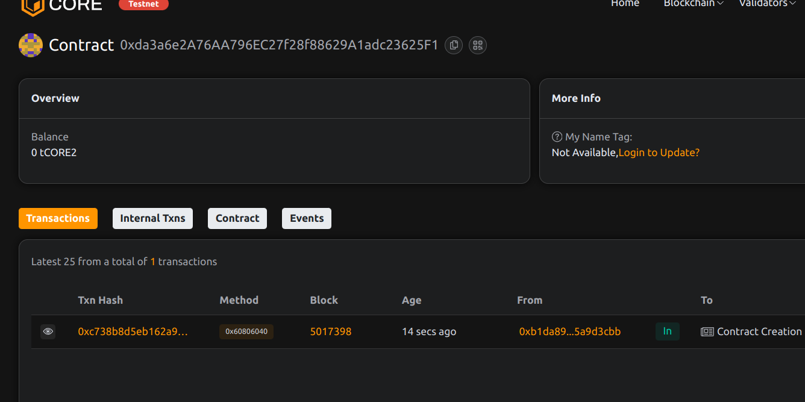

huse# Project Title: RoyaltyFlow: Multi-Creator Revenue Splitting

## Project Description

RoyaltyFlow enables automated, programmable royalty splits between multiple creators, rights holders, or collaborators. It supports transparent and auditable fund distribution based on predefined percentages.

## Project Vision

To streamline fair revenue distribution for collaborative works across art, music, software, and content — directly on-chain, with zero intermediaries.

## Key Features

- Define recipient splits in basis points (10000 = 100%)
- Send ETH to a work ID and automatically split payment
- Fully transparent and auditable payout flows
- Support for dynamic content monetization

## Future Scope

- Tokenized revenue rights as NFTs
- Streaming revenue over time (Superfluid-like)
- Multisig update controls for revenue splits
- Cross-chain revenue routing

## Contract Details
0xda3a6e2A76AA796EC27f28f88629A1adc23625F1

Poonam sahu
